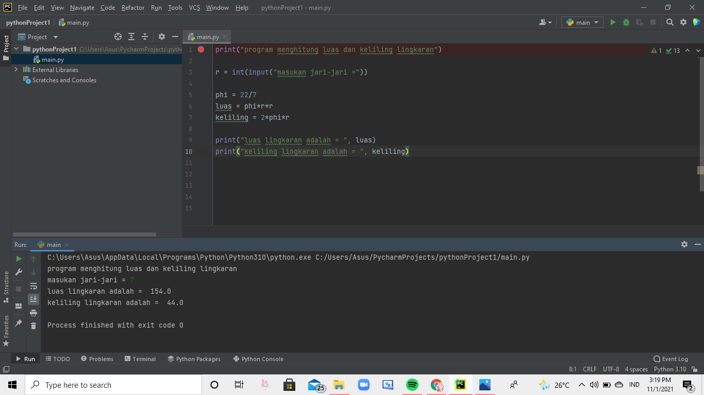
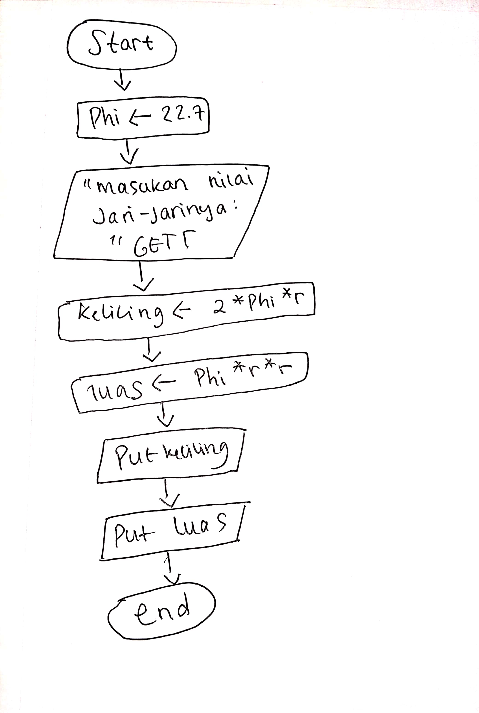

# tugaspertemuanke6
## untuk tugas ke 6

### pertama
yang anda lakukan pertama-tama adalah masukan rumus luas dan keliling lingkaran, seperti contoh gambar dibawah ini 

 
lalu setelah itu anda klik RUN pada bagian atas aplikasinya 

lalu anda masukan jari-jari nya berapa (bebas) 

lalu klik enter, dan hasilnya akan keluar seperti yang ada di atas 

### hasil tugas flowchart seperti ini 

