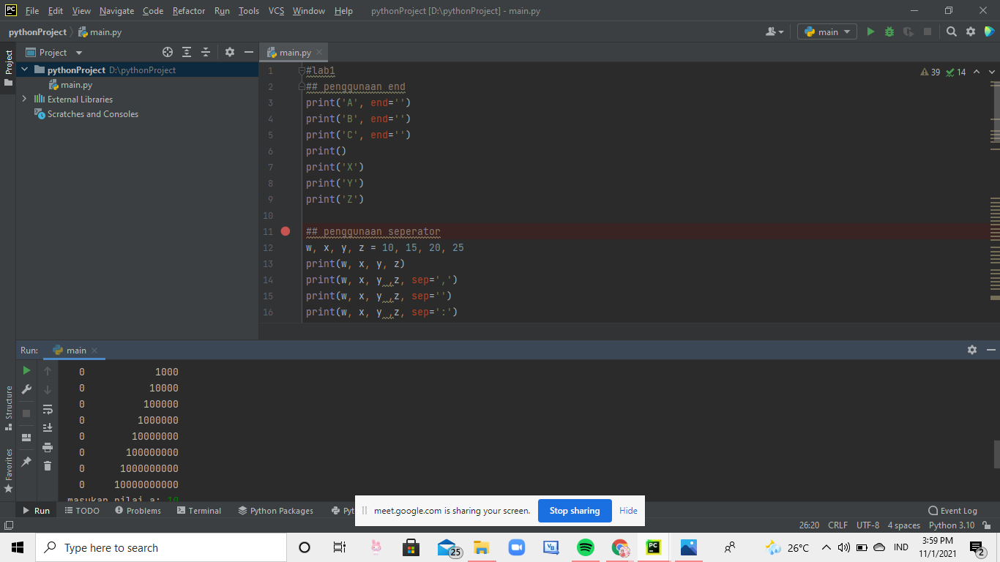
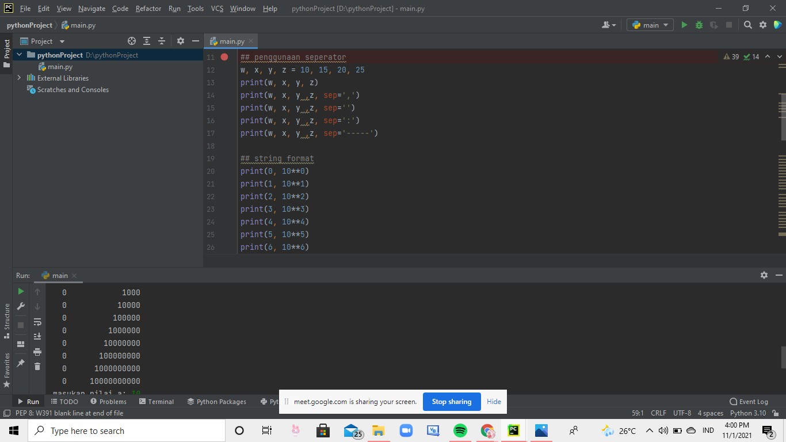
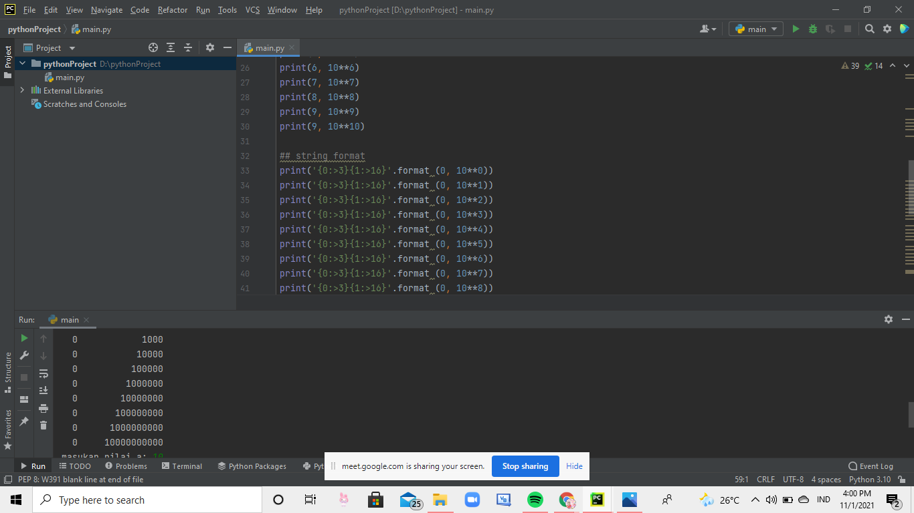
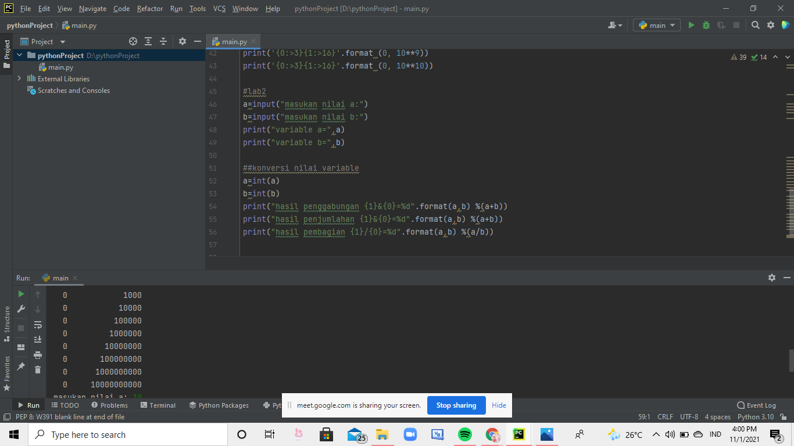
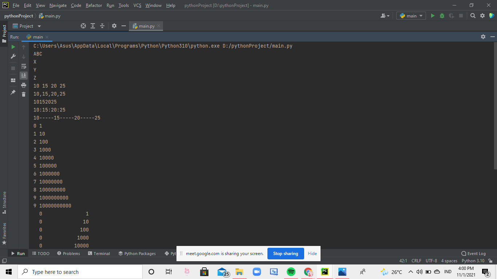
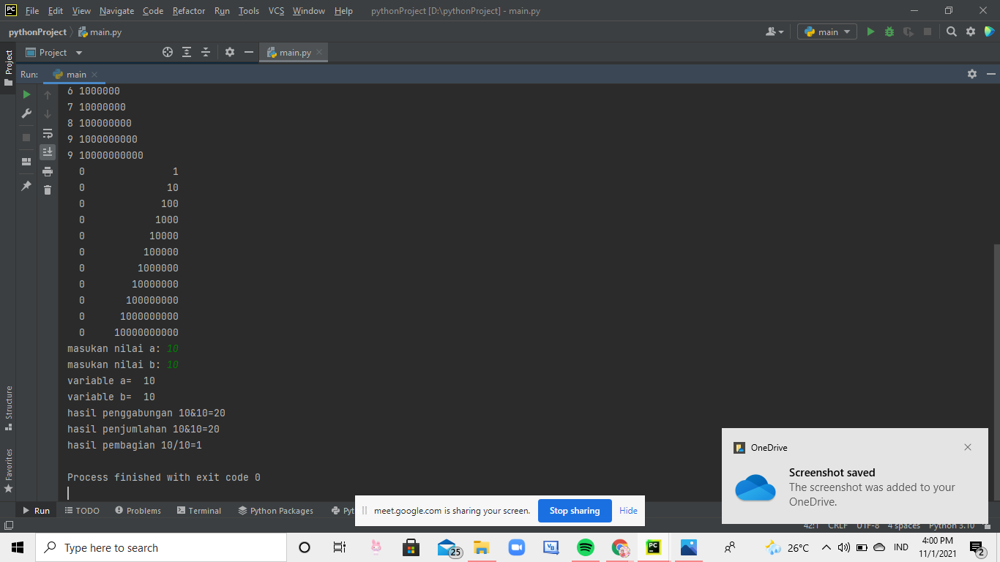

# tugaspertemuanke6
## untuk tugas ke 6

### pertama
yang anda lakukan pertama-tama adalah masukan rumus luas dan keliling lingkaran, seperti contoh gambar dibawah ini 

 
lalu setelah itu anda klik RUN pada bagian atas aplikasinya 

lalu anda masukan jari-jari nya berapa (bebas) 

lalu klik enter, dan hasilnya akan keluar seperti yang ada di atas 

### hasil tugas flowchart seperti ini 

#### latihan pertemuan ke 6 
end berfungsi untuk mengubah tanda yang ada difoto bawah ini 

seperator yang berfungsi sebagai tanda pemisah antar objek yang dicetak. Defaultnya adalah tanda spasi. 

 string format adalah untuk menggabungkan teks dengan variabel lainnya. 

 lab2 itu untuk memasukkan nilai dan variablenya 

 

kalau sudah di run hasilnya akan menjadi seperti ini 

